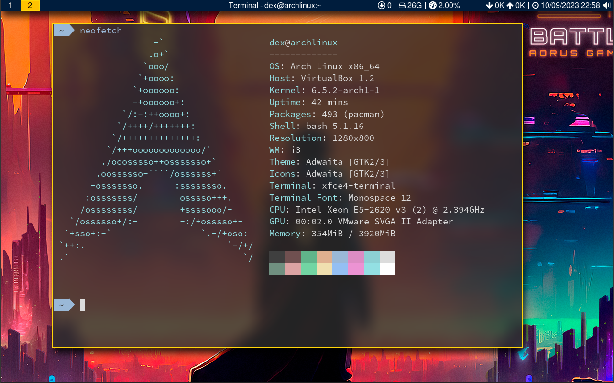

# i3 CONFIG



## Arch Linux
```bash
git clone https://github.com/leonidasroberto/i3wm;cd i3wm;./install.sh arch
```
## Void Linux
```bash
git clone https://github.com/leonidasroberto/i3wm;cd i3wm;./install.sh void
```
## Ubuntu
```bash
git clone https://github.com/leonidasroberto/i3wm;cd i3wm;./install.sh ubuntu
```
